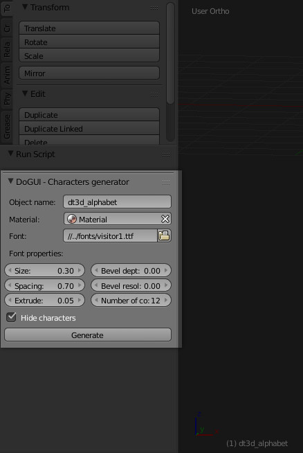
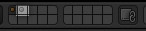
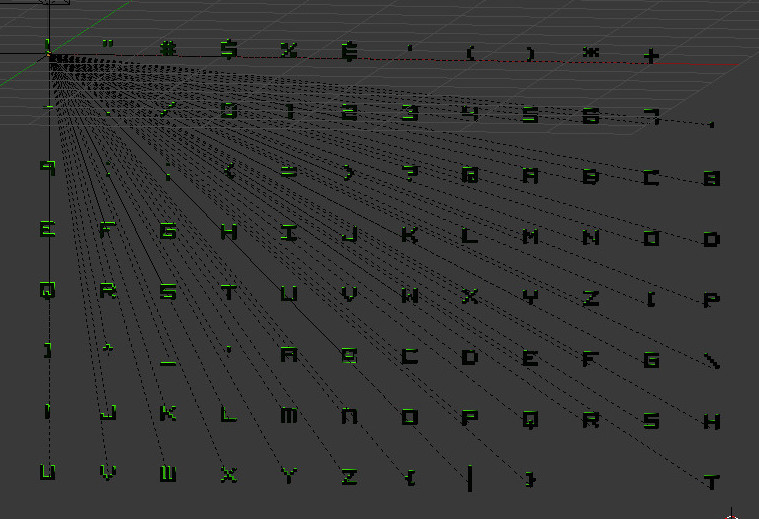
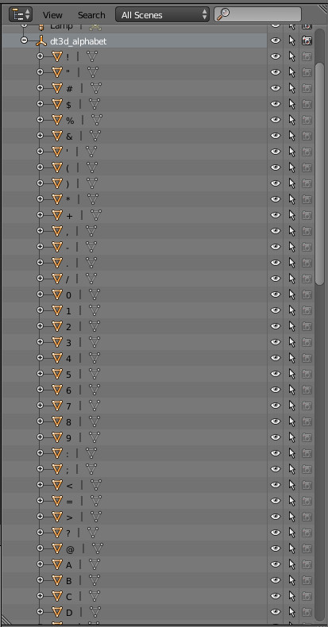
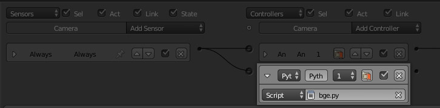
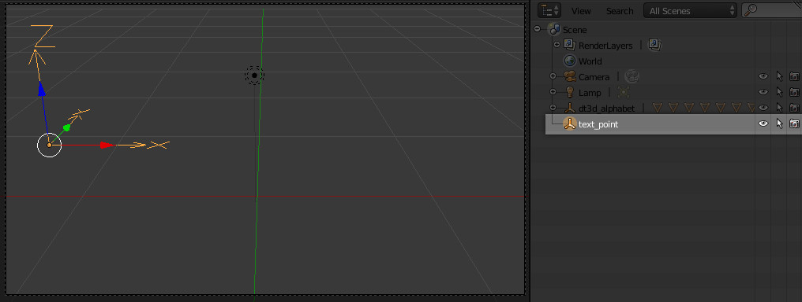
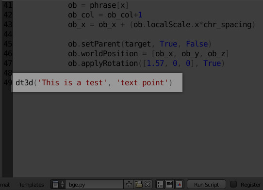
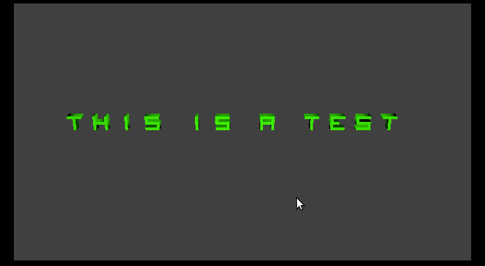

dt3d-addon - concept version
==========

Dynamic Text 3D addon for Blender 3D
This is the first concept to generate 3d characters on blender and map these for use it on blender game engine.

##Getting Started

- [Generating characters](#generating-characters)
- [Using on BGE](#using-on-bge)

### Generating Characters

1. As a concept version the addon package is not ready yet so, to getting start you need to **run** a **[gen.py](https://github.com/mandax/dt3d-addon/blob/master/gen.py)** on blender then you'll get access to the generate panel.

 	On this panel you can set the configurations of the characters that will be generated.
	*(I recommend you use a **bitmap font**, this kind of font will create a better 3d shape)*

	

2.  To use on BGE set "Hide characters" off and if you want to use the characters just as a characters map, make sure that you are generating it in a different layer:

    

3. Click on **Generate** and that's it:

	

    The **Object name** will be set for the parent object of the characters:

    

### Using on BGE

1. Include the **[bge.py](https://github.com/mandax/dt3d-addon/blob/master/bge.py)** script to your BGE project:

    

2. Create a empty object to be the text guide as an initial point and position/scale reference:

	

3. Call the **dt3d()** setting the first argument as a STRING and the second argument as your empty object, **text_point** on this case:

	
    *I just called this on the bge.py script, but you can call it in another place after bge.py was loaded.*

4. Run your game*(Hit **P**)* and there we go!

	